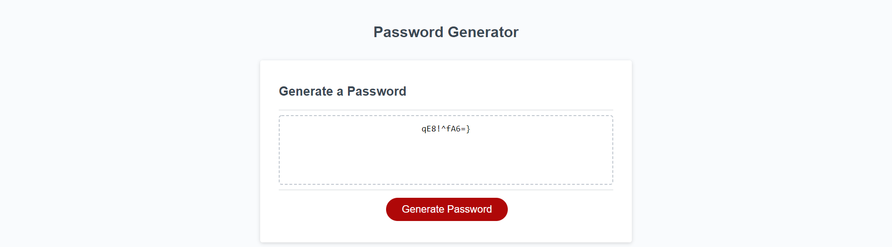

# Module 3 Challenge: Password Generator

The goal of this challenge was to create JavaScript code to generate a random password containing various character types according to given prompts.

## Here is a link to the deployed application: [Deployed Application](https://realnifty.github.io/03-password-generator/)

## Here is a screenshot of the deployed application 
